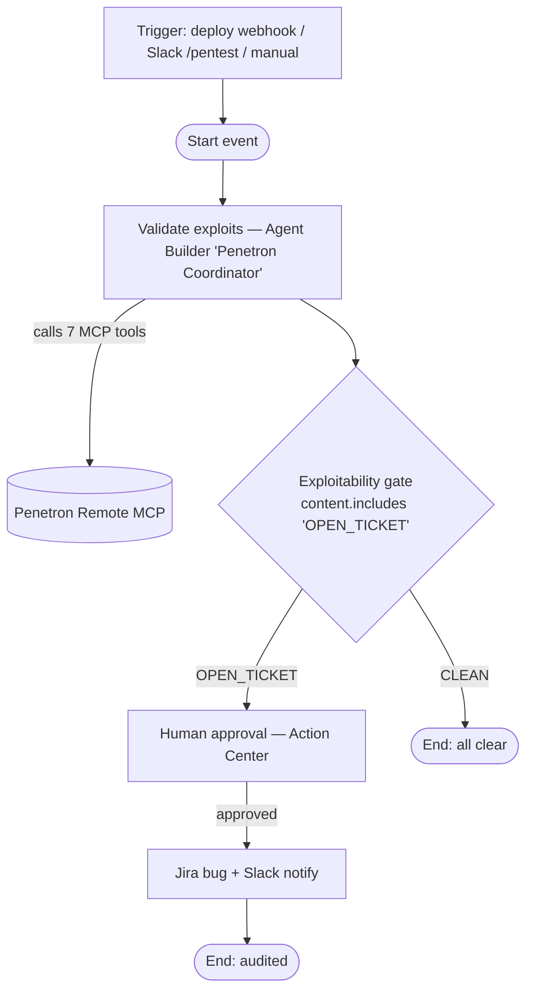
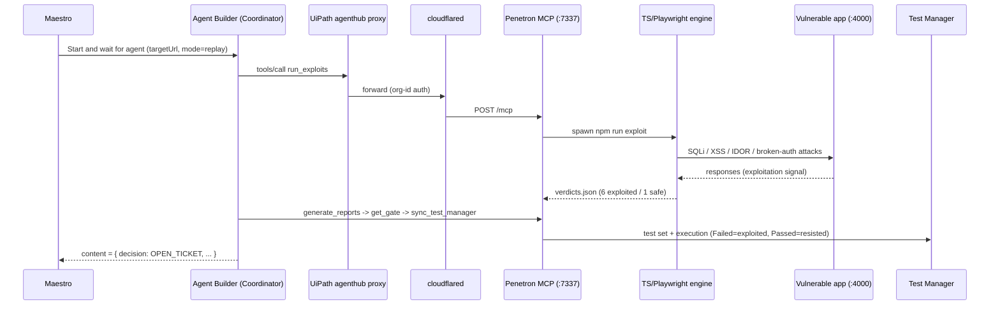

# Penetron — Architecture

Penetron is a two-layer agentic pen-test gate orchestrated and governed by UiPath. **UiPath orchestrates;
it does not itself drive a browser** — browser/API exploits run in a TypeScript + Playwright engine that a
UiPath Agent Builder agent invokes over a Remote MCP server.

## Hero flow (Maestro BPMN)

> Current deployed/green build runs `Start → Validate exploits → End` (the gate logic still executes inside the
> agent and surfaces as `content = OPEN_TICKET`). The approval + Jira/Slack branch is built and being wired back in
> (Action Center provisioning — see `PROJECT-PLAN.md` M8e).

## Layer 2 — how a verdict is produced

## Components & responsibilities

| Layer | Tech | Responsibility |
|---|---|---|
| Orchestration | **UiPath Maestro** (BPMN) | Sequencing, the exploitability gate, human approval, audit trail. |
| Coordination | **UiPath Agent Builder** (Claude Sonnet 4.6) | Calls MCP tools, interprets verdicts, decides escalation. |
| Bridge | **Remote MCP server** (`pentests/src/mcp/server.ts`) | Stateful Streamable HTTP, 7 tools, method-scoped auth (discovery open; `tools/call` gated by bearer **or** UiPath org-id). |
| Execution | **TS + Playwright** (`pentests/src`) | Generates/replays PR-scoped exploit scenarios, asserts on exploitation signals, captures evidence (screenshots, traces). |
| Evidence | **UiPath Test Manager** | Test set + execution per run; red/green = the exploit locker. |
| Writes | Jira REST + Slack Block Kit | Gated behind human approval. |

## Exploit coverage (vs. `target-app/VULNS.md` ground truth)

| Scenario | Class | Exploitation signal | Expected |
|---|---|---|---|
| PNT-EXP-001 | SQLi (auth bypass) | login as admin w/o valid password | exploited |
| PNT-EXP-002 | SQLi (UNION) | response leaks user rows | exploited |
| PNT-EXP-003 | Reflected XSS | DOM marker `window.__pntxss` set | exploited |
| PNT-EXP-004 | Stored XSS | payload executes on view | exploited |
| PNT-EXP-005 | IDOR / BOLA | 200 returns another user's order | exploited |
| PNT-EXP-006 | Broken auth | forged unsigned JWT grants admin | exploited |
| PNT-EXP-007 | SQLi (safe control) | parameterized query resists | **discarded** (proves precision) |

## Determinism for the demo

Replay mode pins the PR + commits the scenario set; the agent runs at temperature 0. Same input → same verdicts →
same gate → same evidence every run. A genuine `regenerate` mode (live scenario generation) is the upgrade path.

## Auth model (Remote MCP)

- **Discovery** (`initialize` / `tools/list` / ping / SSE GET) is open — UiPath's agenthub proxy enumerates tools at
  design time and forwards neither the bearer nor an org-id; tool *metadata* is non-sensitive.
- **Execution** (`tools/call`) is gated behind **either** the bearer (`PENETRON_MCP_TOKEN`, the Orchestrator runtime
  path) **or** a matching UiPath org-id header (`accountid == PENETRON_MCP_ALLOWED_ACCOUNT`), which the agenthub
  proxy supplies at runtime. No separate "Connection" PAT flow is required.

See `docs/uipath-integration-plan.md` for the full integration detail and `uipath/maestro/penetron-process.md`
for the BPMN spec.
